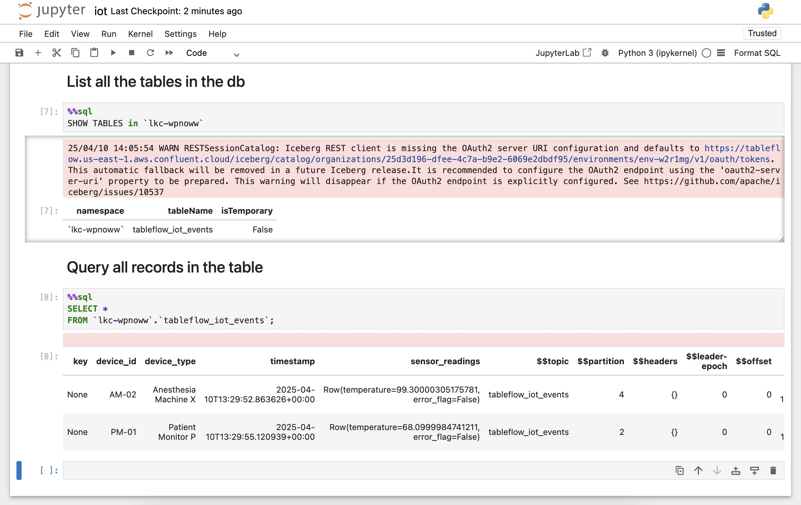
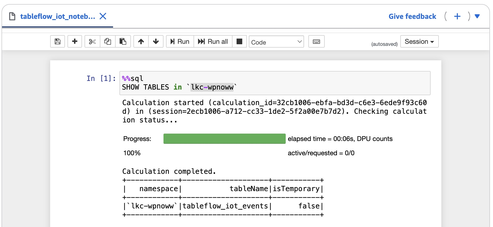
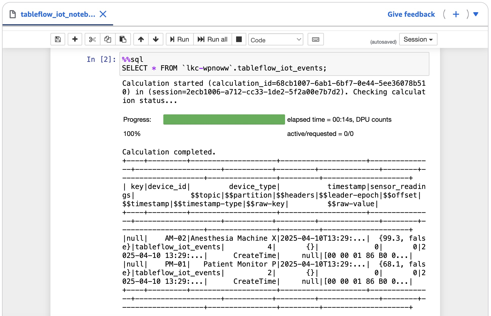

# Tableflow using Managed Storage in Confluent Cloud

<br>

# Overview

This is a bit of a play on [Tableflow Quick Start with Managed Storage in Confluent Cloud](https://docs.confluent.io/cloud/current/topics/tableflow/get-started/quick-start-managed-storage.html)

It's a great exercise for exposing Confluent Cloud kafka topics as Iceberg tables, but with a tweak.

If you want to just follow the website verbatim, that's fine. Otherwise, continue on reading:
- instead lieu of the confluent datagen connector, mock data comes from a python producer to mimick IoT data
- the use of a data contract is required so the datagen program creates an AVRO schema
- this repo leverage the Confluent CLI

If you get stuck, remember in the Confluent Cloud UI is the Confluent AI Assistant. It can not only answer questions, but generate code for you!

In the link above regadring the original hands-on example from Confluent, there are 5 steps:
Step 1: Create a topic and publish data
Step 2: Enable Tableflow on your topic
Step 3: Set up access to the Iceberg REST Catalog
Step 4: Query Iceberg tables from Spark
Step 5: Read Iceberg data from analytics engines (optional)

In this repo, the only thing you are changing is Step 1. So let's do that.

<br>

# Steps

## Step 1. Create a topic and publish data

Edit your [`.env`](./.env) file with your credentials.

Then run the init script:

```bash
./services_setup_all.sh
```

📄 View the script: [`services_setup_all.sh`](./services_setup_all.sh)

Execute a sample user input query:

```bash
python mock_iot_events_generator.py
```

📄 View the program: [`mock_iot_events_generator.py`](./mock_iot_events_generator.py)

<br>

## Step 4. Pro tip

It may help if you simply cat a file instead of using an editor and copy/paste the .ipynb contents into it. It helps avoid funny characters.

```bash
cat iot.ipynb
```

📄 View this file: [`iot.ipynb`](./iot.ipynb)

If everything goes right, you should be able to view your tables and query them in a Jupyter Notebook!

<h3>🔍 Kafka Topics in Action</h3>

<table>
  <tr>
    <td>
      <strong>`jupyter output`</strong><br>
      <a href="./screenshot1.jpg" target="_blank">
        
      </a>
    </td>
  </tr>
</table>

<br>

## Step 5

If everything goes right, you should be ALSO able to view your tables and query them in a Jupyter Notebook!

<h3>🔍 Kafka Topics in Action</h3>

<table>
  <tr>
    <td>
      <strong>`show tables output`</strong><br>
      <a href="./screenshot2.jpg" target="_blank">
        
      </a>
    </td>
  </tr>
  <tr>
    <td>
      <strong>`select * output`</strong><br>
      <a href="./screenshot3.jpg" target="_blank">
        
      </a>
    </td>
  </tr>
</table>

<br>

## Final thoughts

This is really cool. It worked as expected. Kafka topics exposed as Icerberg tables!

Just remember to tear your environment down once you're done.

```bash
./services_destroy_all.sh
```

📄 View the script: [`services_destroy_all.sh`](./services_destroy_all.sh)
